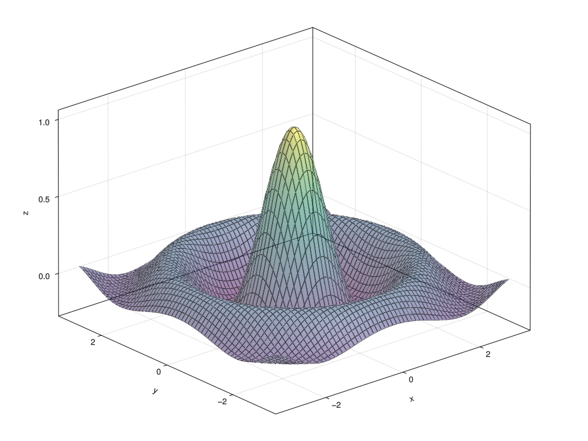

::: questions
- Why should I use Julia?
- How do I get started with Julia?
:::

::: objectives
- Start a REPL
- Run lines from VS Code
:::

:::instructor

### Teaching strategy

Julia is easy to get into because it centers around a few easy to understand core concepts: functions, multiple-dispatch, array polymorphism. It is easy to get needlessly stranded into complications that hinder the pacing of this lesson. For example: when explaining `for` loops you may spend ten minutes explaining all the finesse of `break` and `continue`, but most people will either know or don't care. There are several ways to fill these gaps in the material:

  1. Explain these concepts when they naturally arise in an example or exercise.
  2. Point to their existence in a call-out, but refer interested readers to the relevant section in the Julia manual, to study in their own time.
  3. Give them as part of an exercise: let participants read a section of the manual before solving the exercise. This should empower them to look for the manual when solving their own problems.

  This way, you can move on in a natural pacing, only showing the core concepts relevant to the Julia language, and get to interesting (and motivating) challenges earlier in the lesson.

  You may want to explain this general strategy to participants before starting on the main content. This will build both patience and trust with your audience.
:::

## Overview of the Workshop

It is not feasible to teach all of Julia in just two days. We'll try to get you on your journey with Julia by showing lots of real world examples. During this workshow you will be:

1. (3h) getting started with Julia by simulating gravity: the three body problem. You'll get familiar with the basic syntax of Julia and the little nooks and crannies that set this language appart from Python or MATLAB.
2. (3h) learning to work with Julia's packaging system and best practices.
3. (4h) benchmarking, profiling, type stability and allocations. We will work with many different examples here. You'll learn the most important tools and concepts that matter when you want to write Julia code that runs efficiently.
4. (2h) parallel and GPU programming: computing the Julia fractal.

Some of the examples may be a bit hard to grasp. For example, we'll see a very difficult to understand algorithm to compute $\pi$. In these cases we'll treat the given code as black boxes that we can poke at. The power of a good computer program is often that we don't need to know everything to be able to work with it.

## Why Julia

Most of the participants will be coming from Python, MATLAB or a lower level language like C/C++ or Fortran. Why should you be interested in learning Julia?

### Performance and usability

Julia promises:

- Native performance: close to or sometimes even exceeding C++ or Fortran.
- Solve the multiple language issue: one language for everything (including GPU).
- As easy to get into as Python or R.
- Designed for parallel computing.

These promises seem tantalizing and are in part what draws people to Julia, but in practice getting into Julia and writing performant code are two different things. Julia has its own idiosyncrasies that need to be understood to really squeeze every erg of performance out of your system.

Julia obtains its performance from being a just-in-time (JIT) compiler, on top of the LLVM compiler stack (similar to how Python's Numba operates).

### Language intrinsics

Next to being performant, it turns out that Julia is a very nice language that does some things a bit different from what you may be used to:

- **First-class arrays** and **Broadcasting**: arrays, slicing and operating on arrays have dedicated syntax, similar to MATLAB.
- **Multiple dispatch**: Julia functions can be specialized on the entire call signature (not just its first argument like in Object Oriented Programming).
- **Macros and Meta-programming**: The just-in-time nature of the Julia compiler exposes a wide range of meta-programming capabilities, ranging from small macros to enhance the expressibility of the language to full-on code generation.

Meta-programming, while very powerful, is also very easy to abuse, often leading to unreadable non-idiomatic code. So tread with care! We'll see some examples where macros are indispensable though, and the SciML stack relies deeply on on-the-fly code-generation.

:::discussion
Why are you interested in Julia? What is your current go-to for efficient computing?
:::

## Recommended materials

If you want to learn more about computer programming in general, a great place to start is [Structure and Interpretation of Computer Programs](https://web.mit.edu/6.001/6.037/sicp.pdf), including the [Lectures on Youtube](https://www.youtube.com/playlist?list=PLE18841CABEA24090). These are old but wonderful and really teach some wisdom around designing complex software systems. Also, this might cure any latent adiction to object oriented programming.

If you want to learn about efficient programming in Julia, check out [Parallel Computing and Scientific Machine Learning](https://www.youtube.com/playlist?list=PLCAl7tjCwWyGjdzOOnlbGnVNZk0kB8VSa). These go in much more detail than we can do in this lecture.

The materials in this lesson are aimed somewhere in between SICP and PCSML. We'll look at real scientific examples to dive into computational concepts.

## Running Julia

When working in Julia it is very common to do so from the REPL (Read-Eval-Print Loop). Please open the Julia REPL on your system

```shell
$ julia
```

```output
               _
   _       _ _(_)_     |  Documentation: https://docs.julialang.org
  (_)     | (_) (_)    |
   _ _   _| |_  __ _   |  Type "?" for help, "]?" for Pkg help.
  | | | | | | |/ _` |  |
  | | |_| | | | (_| |  |  Version 1.10.3 (2024-04-30)
 _/ |\__'_|_|_|\__'_|  |  Official https://julialang.org/ release
|__/                   |

julia>
```

The REPL needs a small introduction since it has several **modes**.

| Key | Prompt | Mode |o
|-----|--------|------|
| None | `julia>` | Standard **Julia** input. |
| `]` | `pkg>` | **Pkg** mode. Commands entered here are functions in the `Pkg` module. |
| `;` | `shell>` | **Shell** mode. |
| `?` | `help?>` | **Help** mode. Type the name of any entity to look up its documentation. |

To switch back to the standard Julia input from another mode, press `Ctrl+C`

:::challenge

### Play with the REPL (5min)

a. `Pkg` mode has a `help` command to help you along. Find out what the `add` command does.
b. Check the contents of the folder in which you are running your REPL (`ls` on Unix, `dir` on Windows).
c. Find out what the `print` method does in Julia.

::::solution
a. `]help add`, the `add` command installs packages
b. `;ls`
c. `?print`
::::
:::

::: callout
Please take a look at the Julia documentation now at [https://docs.julialang.org/en/v1/](https://docs.julialang.org/en/v1/).
:::

## Pluto

Pluto is the notebook environment from which we will teach much of this workshop. We can run it from the Julia REPL.

```output
pkg> add Pluto
... quite a bit of output ...

julia> using Pluto

julia> Pluto.run()
[ Info: Loading...
┌ Info:
└ Opening http://localhost:1235/?secret=xyzxyzxyz in your default browser... ~ have fun!
┌ Info:
│ Press Ctrl+C in this terminal to stop Pluto
└
```


## VS Code
VS Code is the editor for which Julia has the best support. We'll be needing to run Julia in multiple threads later on, so we'll set some arguments for the REPL in `settings.json` (press `Ctrl+Shift+P` and search for `Open User Settings (JSON)`).

```json
{
    ...
    "julia.additionalArgs": [ 
        "-t", "4"
    ]
}
```

Now when you start a new REPL (`Ctrl+Shift+P`, search "Julia REPL"), you can query the number of threads available:

```julia
Threads.nthreads()
```


:::challenge
### Julia as a calculator (5min)

Try to play around in the VS Code REPL to use Julia as a calculator.

a. What do you find is the operator for exponentiation?
b. How do you assign a variable?
c. What happens when you divide any two integers? Use the `typeof` function to inspect the type of the result. Can you figure out how to integer division (search the documentation!)?
d. What happens in Pluto when you change a variable that is depended upon?

::::solution
a. In Julia exponentiation is `^`.
b. Just like you're used to `x = 3`.
c. The `/` operator always returns a floating point value. To get to integer division, we want the `÷` operator, which can be typed using `\div` and then press TAB. Or you can use the equivalent `div` function.
d. Pluto updates all dependent computations automatically. This is known as a **reactive notebook**.
::::
:::

::: keypoints
- In Julia, the REPL is much more important than in some other languages.
- Pluto is a reactive environment
- VS Code has the best editor integration for Julia
:::

## Activate the Workshop Environment

For this workshop, we prepared an environment. Press `]` in the REPL to activate `Pkg` mode.
Make sure that you are in the path where you prepared your environment (see Setup Instructions).

```
(v1.12) pkg> activate .
(EfficientJulia) pkg>
```

Alternatively, check the little "Julia env" message at the bottom of VS Code, and make sure that the correct environment is there.

You should now be able to generate a plot using `GLMakie` (that one dependency that made you wait)

```julia
using GLMakie
x = -3.0:0.1:3.0
z = sinc.(sqrt.(x.^2 .+ x'.^2))
surface(x, x, z, alpha=0.5)
wireframe!(x, x, z, color=:black, linewidth=0.5)
```

{alt="A 3d rendering of a sinc function."}

::: spoiler
### Figure code

To create the above figure:

```julia
#| classes: ["task"]
#| creates: episodes/fig/getting-started-makie.png
#| collect: figures

module Script
using GLMakie

function main()
    x = -3.0:0.1:3.0
    z = sinc.(sqrt.(x.^2 .+ x'.^2))

    fig = Figure(size=(1024, 768))
    ax = Axis3(fig[1,1])
    surface!(ax, x, x, z, alpha=0.5)
    wireframe!(ax, x, x, z, color=:black, linewidth=0.5)
    save("episodes/fig/getting-started-makie.png", fig)
end
end

Script.main()
```
:::
