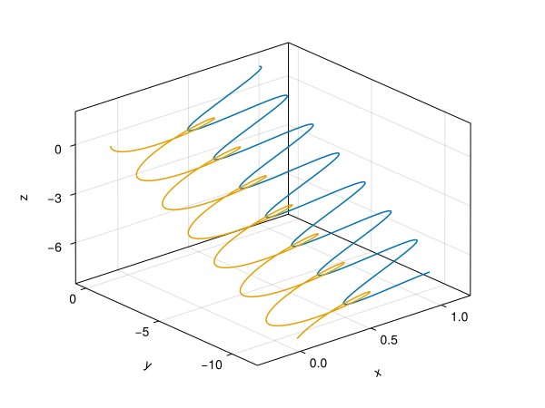
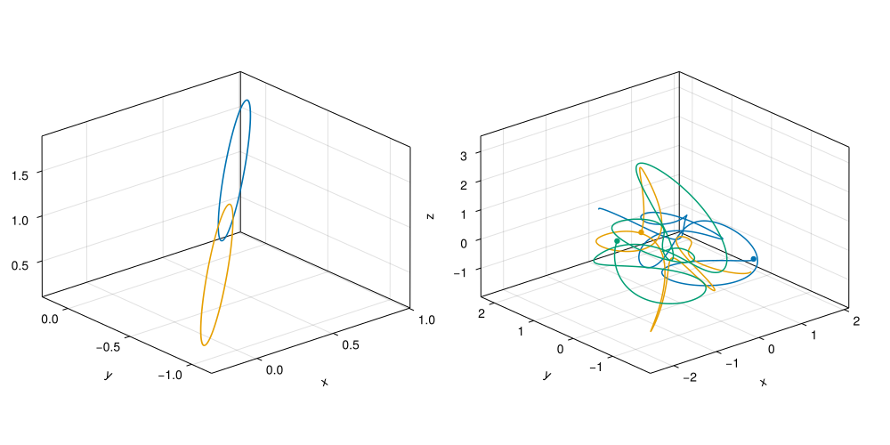

::: questions
- How can I work with physical units?
- How do I quickly visualize some data?
- How is dispatch used in practice?
:::

::: objectives
- Learn to work with `Unitful`
- Take the first steps with `Makie` for visualisation
- Work with `const`
- Define a `struct`
- Get familiar with some idioms in Julia
:::

In this episode we'll be building a simulation of the solar system. That is, we'll only consider the Sun, Earth and Moon, but feel free to add other planets to the mix later on! To do this we need to work with the laws of gravity. We will be going on extreme tangents, exposing interesting bits of the Julia language as we go.

## Introduction to `Unitful`
We'll be using the `Unitful` library to ensure that we don't mix up physical units.

```julia
using Unitful
```

Using `Unitful` is without any run-time overhead. The unit information is completely contained in the `Quantity` type.
With `Unitful` we can attach units to quantities using the `@u_str` syntax:

```julia
1.0u"kg" == 1000.0u"g"
```

```julia
2.0u"m" - 8.0u"cm"
```

At the moment it is not important to precisely understand the syntax. Just notice that the information on the units is stored in Julia's type system:

```julia
typeof(2.0u"m")
```

```output
Quantity{Float64, 𝐋, Unitful.FreeUnits{(m,), 𝐋, nothing}}
```

We see a `Quantity` represented by a double precision floating-point value, having dimension of length, and units of meters. All of the unit information is captured in the type system, which only acts at compile time. At run-time, this is an ordinary `Float64`.

:::instructor
### Breaking down the syntax
You may get questions about the syntax. If you have time, this is how to break it down.

There is a bit of syntax to break down here. A number followed by an identifier are multiplied with the `*` operator. This is just syntactic sugar, but it makes certain expressions nicer.

```julia
gaussian(μ, σ) = x -> 1/√(2π)σ * exp(-(x - μ)^2 / 2σ^2)
```

At the same time, there is such a thing as `_str` macros.

```julia
macro twice_str(a)
    :($a * $a)
end

twice"Hello"
```

```output
"HelloHello"
```

Combining the `@u_str` macro, which is defined in `Unitful`, with the multiplication sugar gets us here:

```julia
@macroexpand 3u"m/s"
```
:::

::: challenge
### Try adding incompatible quantities
For instance, add a quantity in meters to one in seconds. Be creative. Can you understand the error messages?
:::

Next to that, we use the `Vec3d` type from `GeometryBasics` to store vector particle positions.

```julia
using LinearAlgebra
using GeometryBasics
```

Libraries in Julia tend to work well together, even if they're not principally designed to do so. We can combine `Vec3d` with `Unitful` with no problems.

```julia
Vec3d(1, 2, 3)u"km"
```

:::challenge
### Generate random Vec3d
The `Vec3d` type is a static 3-vector of double precision floating point
values. Read the documentation on the [`randn` function](https://docs.julialang.org/en/v1/stdlib/Random/#Base.randn).
Can you figure out a way to generate a random `Vec3d`?

::::solution
One way is to generate three random numbers and convert the resulting array to a `Vec3d`:

```julia
Vec3d(randn(Float64, 3))
```

But it is even better to call `randn` with the `Vec3d` argument directly:

```julia
randn(Vec3d)
```

(We can time these using `@btime` from `BenchmarkTools`)
::::
:::

Two bodies of mass $M$ and $m$ attract each other with the force

$$F = \frac{GMm}{r^2},$$

where $r$ is the distance between those bodies, and $G$ is the universal gravitational constant.

```julia
#| id: gravity
const G = 6.6743e-11u"m^3*kg^-1*s^-2"
gravitational_force(m1, m2, r) = G * m1 * m2 / r^2
```

Verify that the force exerted between two 1 million kg bodies at a distance of 2.5 meters is about equal to holding a 1kg object on Earth. Or equivalently two one tonne objects at a distance of 2.5 mm (all of the one tonne needs to be concentrated in a space tiny enough to get two of them at that close a distance)

A better way to write the force would be,

$$\vec{F} = \hat{r} \frac{G M m}{|r|^2},$$

where $\hat{r} = \vec{r} / |r|$, so in total we get a third power, $|r|^3 = (r^2)^{3/2}$, where $r^2$ can be computed with the dot-product. 

```julia
#| id: gravity
"""
    gravitational_force(m1, m2, r)

Returns the gravitational force as a function of masses `m1` and `m2` and `r` the distance vector between them. The force will be in the direction of `r`.
"""
gravitational_force(m1, m2, r::AbstractVector) =
    r * (G * m1 * m2 * (r ⋅ r)^(-1.5))
```
	
```julia
gravitational_force(1e3u"kg", 1e3u"kg", Vec3d(2.5, 0, 0)u"mm") .|> u"N"
```

:::callout
Not all of you will be jumping up and down for doing high-school physics.
We will get to other sciences than physics later in this workshop, I promise!
:::

:::instructor
### Unnessecary detail about the `dot` operator
The `⋅` operator (enter using `\cdot<TAB>`) performs the `LinearAlgebra.dot` function. We could have done `sum(r * r)`. However, the `sum` function works on iterators and has a generic implementation. We could define our own `dot` function:

```julia
function dot(a::AbstractVector{T}, b::AbstractVector{T}) where {T}
    Prod = typeof(zero(T) * zero(T))
	x = zero(Prod)
	@simd ivdep for i in eachindex(a)
		x += a[i] * b[i]
	end
	return x
end
```

If we look for the source

```
@which LinearAlgebra.dot(a, b)
```

We find that we're actually running the dot product from the `StaticArrays` library, which has a very similar implementation as ours.
:::

:::callout
### The `zero` function
The `zero` function is overloaded to return a zero object for any type that has a natural definition of zero.
:::

:::challenge
### The `one` function
The return-value of `zero` should be the additive identity of the given type. So for any type `T`:

```julia
let T = Int, x = rand(T); x == x + zero(T) end
```

There also is the `one` function which returns the multiplicative identity of a given type. Try to use the `*` operator on two strings. What do you expect `one(String)` to return?
:::

## Particles
We are now ready to define the `Particle` type. First we define some constants so that our code remains readable.

```julia
#| id: gravity

const Mass = typeof(1.0u"kg")
const MomentumVector = typeof(Vec3d(1)u"kg*m/s")
const PositionVector = typeof(Vec3d(1)u"m")
const VelocityVector = typeof(Vec3d(1)u"m/s")
```

```julia
#| id: gravity
mutable struct Particle
    mass::Mass
    position::PositionVector
    momentum::MomentumVector
end
```

We can write a function to generate random particles with some spread and (velocity) dispersion:

```julia
#| id: gravity
random_particle(mass=1e6u"kg", spread=1.0u"m", dispersion=2.0u"mm/s") =
    Particle(mass, randn(Vec3d) * spread, randn(Vec3d) * dispersion * mass)

function random_particles(n; seed=0, args...)
    Random.seed!(seed)
    [random_particle(args...) for _ in 1:n]
end
```

Note the ellipsis `...`. Those do variadic argument capture.
We can also define a function to  obtain the velocity of a particle:

```julia
velocity(p::Particle) = p.momentum / p.mass
```

:::challenge
### Getters

a. Create $N$ random particles (say $N=3$, but it really doesn't matter), and get their velocity in a one-liner. Don't use for-loops, just broadcasting.

b. Can you do the same for obtaining the position and/or momentum? Implement a getter for those properties.

c. We can also meaningfully extend the getter for `momentum` on collections of particles. The total momentum of a set of particles is the sum of their individual momenta. Read the documention on the `sum` function. Can you find a particularly nice way to implement `momentum(p::AbstractArray{Particle})`?

d. Do the same for the total mass of a set of particles. Can you now generalize the definition for `velocity`, so that the same function works for particles and collections of particles?

::::solution

```julia
velocity.(random_particles(3))
```

or
    
```julia
random_particles(3) .|> velocity
```

```julia
#| id: gravity
mass(p::Particle) = p.mass
position(p::Particle) = p.position
momentum(p::Particle) = p.momentum

# random_particles(3) .|> momentum
# etc...

mass(p::AbstractArray{Particle}) = sum(mass, p)
momentum(p::AbstractArray{Particle}) = sum(momentum, p)
velocity(p) = momentum(p) / mass(p)
```

By abstracting struct member access into functions, we could write some very elegant code to compute the total net velocity of a group of particles! In general, it is considered good practice to create accessor functions like this, so that functions that rely on member access then become more portable (i.e. they can be made to work on other types by extending the accessor methods).
::::
:::

It is custom to divide the computation of orbits into a *kick* and *drift* function. (There are deep mathematical reasons for this that we won't get into.)
We'll first implement the `kick!` function, that updates a collection of particles, given a certain time step.

## The kick
The following function performs the `kick!` operation on a set of particles. We'll go on a little tangent for every line in the function.

```julia
#| id: gravity
function kick!(particles, dt)
    for i in eachindex(particles)
        for j in 1:(i-1)
            r = particles[j].position - particles[i].position
            force = gravitational_force(particles[i].mass, particles[j].mass, r)
            particles[i].momentum += dt * force
            particles[j].momentum -= dt * force
        end
    end
    return particles
end
```

:::callout
### Why the `!` exclamation mark?
In Julia it is custom to have an exclamation mark at the end of names of functions that mutate their arguments.
:::

:::callout
### Use `eachindex`
Note the way we used `eachindex`. This idiom guarantees that we can't make out-of-bounds errors. Also this kind of indexing is generic over other collections than vectors. However, this generality is lost in the inner loop, where we use explicit numeric bounds. In this case those bounds actually half the amount of work we need to do, so the sacrifice is justified.
:::

:::callout
### Broadcasting vs. specialization
We're subtracting two vectors. We could have written that with dot-notation indicating a broadcasted function application. Generate two random numbers:

```julia
a, b = randn(Vec3d, 2)
```

Then time the subtraction broadcasted and non-broadcasted. Which is faster? Why?

::::solution

```julia
@btime a - b
@btime a .- b
```

Broadcasting is slower. It seems to do some needless allocation. Clearly, the authors of `GeometryBasics` have taken effort to optimize basic vector operations.
::::
:::

:::callout
We're iterating over the range `1:(i-1)`, and so we don't compute forces twice. Momentum should be conserved!
:::

Luckily the `drift!` function is much easier to implement, and doesn't require that we know about all particles.

```julia
#| id: gravity
function drift!(p::Particle, dt)
    p.position += dt * p.momentum / p.mass
end

function drift!(particles, dt)
    for p in particles
        drift!(p, dt)
    end
    return particles
end
```

Note that we defined the `drift!` function twice, for different arguments. We're using the dispatch mechanism to write clean/readable code.

:::instructor
### Fixing arguments
One pattern that you can find repeatedly in the standard library is that of *fixing* arguments of functions to make them more composable.
For instance, most comparison operators allow you to give a single argument, saving the second argument for a second invocation.

```julia
smaller_than_3 = <(3)
smaller_than_3(1)
smaller_than_3(5)
```

This can be useful to write filter operations consisely:

```julia
filter(x -> x < 3, 1:5)
filter(<(3), 1:5)
```

and even

```julia
map(filter(<(5)), eachcol(rand(1:10, 5, 5)))
```

We can do a similar thing here:

```julia
#| id: gravity
kick!(dt) = Base.Fix2(kick!, dt)
drift!(dt) = Base.Fix2(drift!, dt)
```

These kinds of identities let us be flexible in how to use and combine methods in different circumstances.

```julia
#| id: gravity
leap_frog!(dt) = drift!(dt) ∘ kick!(dt)
```

This defines the `leap_frog!` function as first performing a `kick!` and then a `drift!`. Another way to compose these functions is the `|>` operator.
In contrast to the `∘` operator, `|>` is very popular and seen everywhere in Julia code bases.

```julia
leap_frog!(particles, dt) = particles |> kick!(dt) |> drift!(dt)
leap_frog!(dt) = Base.Fix2(leap_frog!, dt)
```

:::

```julia
#| id: gravity

"""
    leap_frog!(particles, dt)

One leap-frog integration time step `dt` for `particles` under
gravity.
"""
function leap_frog!(particles, dt)
    drift!(particles, dt/2)
    kick!(particles, dt)
    drift!(particles, dt/2)
end
```

## With random particles
Let's run a simulation with some random particles

```julia
#| id: gravity
function run_simulation(particles, dt, n_steps)
    x = deepcopy(particles)
    [deepcopy(leap_frog!(x, dt)) for _ in 1:n_steps]
end

function random_orbits(n, mass; dt=1.0u"s", steps=5000, args...)
    particles = random_particles(n; args...)
    run_simulation(particles, dt, steps) |> collect
end
```

:::spoiler

### Plot

```julia
#| classes: ["task"]
#| file: scripts/plot-two-body-drift.jl
#| creates: episodes/fig/two-body-drift.svg
#| collect: figures
module Script

using Unitful
using CairoMakie
using EfficientJulia.Gravity

function main()
    fig = Figure()
    ax = Axis3(fig[1, 1])

    orbits = run_simulation(
        random_particles(2), 1.0u"s", 5000)
    for i in 1:2
        orbit = position.(getindex.(orbits, i))
        lines!(ax, orbit / u"m")
    end
    save("episodes/fig/two-body-drift.svg", fig)
end

end

Script.main()
```

:::

{alt="Orbits of two particles are drifting."}

As you see, the random particles we generated have a non-zero total momentum.


### Frame of reference
We need to make sure that our entire system doesn't have a net velocity. Otherwise it will be hard to visualize our results!

```julia
#| id: gravity
function set_still!(particles)
    v = velocity(particles)
    for p in particles
        p.momentum -= v * mass(p)
    end
    return particles
end
```

:::spoiler

### Plot

```julia
#| classes: ["task"]
#| file: scripts/plot-two-body-still.jl
#| creates: episodes/fig/random-orbits.svg
#| collect: figures
module Script

using Unitful
using CairoMakie
using EfficientJulia.Gravity

function main()
    fig = Figure(size=(1000, 500))
    ax1 = Axis3(fig[1, 1])

    orbits = run_simulation(
        set_still!(random_particles(2)), 1.0u"s", 5000)
    for i in 1:2
        orbit = position.(getindex.(orbits, i))
        lines!(ax1, orbit / u"m")
    end

    ax2 = Axis3(fig[1, 2])
    orbits = run_simulation(
        set_still!(random_particles(3, seed=3)), 1.0u"s", 5000)
    for i in 1:3
        orbit = position.(getindex.(orbits, i))
        lines!(ax2, orbit / u"m")
        scatter!(ax2, orbit[end] / u"m")
    end
    save("episodes/fig/random-orbits.svg", fig)
end

end

Script.main()
```

:::

{alt="Orbits of particles set still. Two particles give elliptic orbits, three make total chaos."}


## Solar System

```julia
#| id: gravity
# const SUN = Particle(2e30u"kg",
#     Vec3d(0.0)u"m",
#     Vec3d(0.0)u"m/s")

# const EARTH = Particle(6e24u"kg",
#     Vec3d(1.5e11, 0, 0)u"m",
#     Vec3d(0, 3e4, 0)u"m/s")

# const MOON = Particle(7.35e22u"kg",
#     EARTH.position + Vec3d(3.844e8, 0.0, 0.0)u"m",
#     velocity(EARTH) + Vec3d(0, 1e3, 0)u"m/s")
```

::: challenge
## Challenge

Plot the orbit of the moon around the earth. Make a `Dataframe` that contains all model data, and work from there. Can you figure out the period of the orbit?
:::

::: keypoints
- standard functions like `rand`, `zero` and operators can be extended by libraries to work with new types 
- functions (not objects) are central to programming Julia
- don't over-specify argument types: Julia is dynamically typed, embrace it
- `eachindex` and relatives are good ways iterate collections
:::

::: spoiler
### Testing and Plots

```julia
#| file: src/Gravity.jl
module Gravity

using Unitful
using GeometryBasics
using DataFrames
using LinearAlgebra
using Random

import Base: position

export random_partcle, random_particles, velocity, mass, momentum, position
export run_simulation, set_still!

<<gravity>>

end
```

```julia
##| classes: ["task"]
#| creates: episodes/fig/random-orbits.png
#| collect: figures

module Script

using Unitful
using GLMakie
using DataFrames
using Random
using EfficientJulia.Gravity: random_orbits

function plot_orbits!(ax, orbits::DataFrame)
    for colname in names(orbits)[2:end]
        scatter!(ax, [orbits[1,colname] / u"m"])
        lines!(ax, orbits[!,colname] / u"m")
    end
end

function main()
    Random.seed!(0)
    orbs1 = random_orbits(2, 1e6u"kg")
    Random.seed!(15)
    orbs2 = random_orbits(3, 1e6u"kg")

    fig = Figure(size=(1024, 600))
    ax1 = Axis3(fig[1,1], azimuth=π/2+0.1, elevation=0.1π, title="two particles")
    ax2 = Axis3(fig[1,2], azimuth=π/3, title="three particles")

    plot_orbits!(ax1, orbs1)
    plot_orbits!(ax2, orbs2)

    save("episodes/fig/random-orbits.png", fig)
    fig
end

end

Script.main()
```
:::
