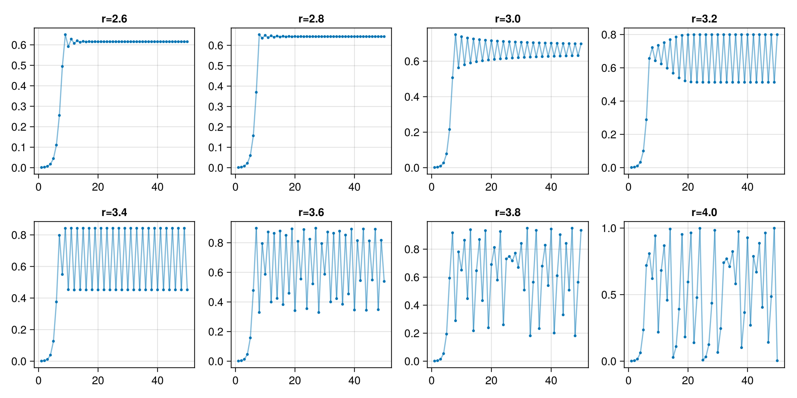
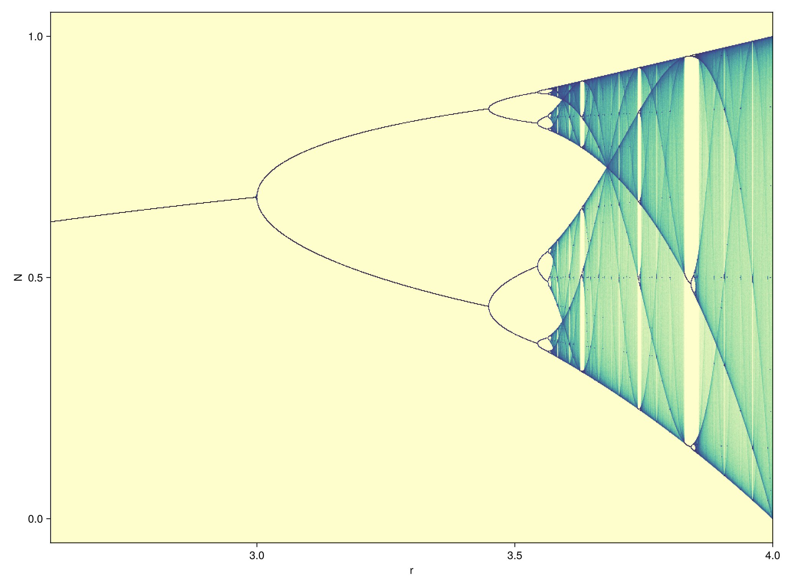

::: questions
- How can I reduce the number of allocations?
:::

::: objectives
- Apply a code transformation to write to pre-allocated memory.
:::

## About Memory

There are roughly two types of memory in a computer program:

- stack: memory that lives statically inside a function. This memory is very fast, but the size is limited and has to be known at **compile time**. Examples: variables of known size created in a block scope, and released after.
- heap: memory that is associated with the entire process. Needs to be allocated. Examples: arrays, strings. In general heap allocation (and freeing) is slow: the process has to ask the OS for memory.

Later on we will talk some more about memory. In the current episode we'll see how we can reduce allocations.

## Logistic map

Logistic growth (in economy or biology) is sometimes modelled using the recurrence formula:

$$N_{i+1} = r N_{i} (1 - N_{i}),$$

also known as the **logistic map**, where $r$ is the **reproduction factor**. For low values of $N$ this behaves as exponential growth. However, most growth processes will hit a ceiling at some point. Let's try:

```julia
#| id: logistic-map
logistic_map(r) = n -> r * n * (1 - n)
```

```julia
using IterTools
using GLMakie
using .Iterators: take, flatten
```

```julia
take(iterated(logistic_map(3.0), 0.001), 200) |> collect |> lines
```

::: challenge
### Vary `r`
Try different values of $r$, what do you see?

Extra (advanced!): see the [Makie documentation on `Slider`](https://docs.makie.org/stable/reference/blocks/slider). Can you make an interactive plot?

:::: solution
```julia
using Printf
let
    fig = Figure()
    sl_r = Slider(fig[2, 2], range=1.0:0.001:4.0, startvalue=2.0)
    Label(fig[2,1], lift(r->@sprintf("r = %.3f", r), sl_r.value))
    points = lift(sl_r.value) do r
        take(iterated(logistic_map(r), 0.001), 50) |> collect
    end
    ax = Axis(fig[1, 1:2], limits=(nothing, (0.0, 1.0)))
    plot!(ax, points)
    lines!(ax, points)
    fig
end
```
::::
:::

{alt="a grid of 8 different plots with qualitative different behaviour"}

::: spoiler
### Plotting code
```julia
#| classes: ["task"]
#| collect: figures
#| creates: episodes/fig/logistic-map-orbits.png

module Script
using IterTools
using .Iterators: take
using GLMakie

function main()
    logistic_map(r) = n -> r * n * (1 - n)
    fig = Figure(size=(1024, 512))
    for (i, r) in enumerate(LinRange(2.6, 4.0, 8))
        ax = Axis(fig[div(i-1, 4)+1, mod1(i, 4)], title="r=$$r")
        pts = take(iterated(logistic_map(r), 0.001), 50) |> collect
        lines!(ax, pts, alpha=0.5)
        plot!(ax, pts, markersize=5.0)
    end
    save("episodes/fig/logistic-map-orbits.png", fig)
end
end

Script.main()
```
:::

There seem to be key values of $r$ where the iteration of the logistic map splits into periodic orbits, and even get into chaotic behaviour.

We can plot all points for an arbitrary sized orbit for all values of $r$ between 2.6 and 4.0. First of all, let's see how the `iterated |> take |> collect` function chain performs.

```julia
using BenchmarkTools
@btime take(iterated(logistic_map(3.5), 0.5), 1000) |> collect
```

```julia
function iterated_fn(f, x, n)
    result = Float64[]
    for i in 1:n
        x = f(x)
        push!(result, x)
    end
    return result
end

@btime iterated_fn(logistic_map(3.5), 0.5, 1000)
```

That seems to be slower than the original! Let's try to improve:

```julia
function iterated_fn(f, x, n)
    result = Vector{Float64}(undef, n)
    for i in 1:n
        x = f(x)
        result[i] = x
    end
    return result
end

@benchmark iterated_fn(logistic_map(3.5), 0.5, 1000)
@profview for _=1:100000; iterated_fn(logistic_map(3.5), 0.5, 1000); end
```

We can do better if we don't need to allocate:

```julia
function iterated_fn!(f, x, out)
    for i in eachindex(out)
        x = f(x)
        out[i] = x
    end
end

out = Vector{Float64}(undef, 1000)
@benchmark iterated_fn!(logistic_map(3.5), 0.5, out)
@profview for _=1:100000; iterated_fn!(logistic_map(3.5), 0.5, out); end
```

Try to change the 1000 into 10000. What is the conclusion? Small allocations inside loops contribute to run-time. The `iterator |> collect` pattern is usually good enough.

```julia
#| id: logistic-map
function logistic_map_points(r::Real, n_skip)
    make_point(x) = Point2f(r, x)
    x0 = nth(iterated(logistic_map(r), 0.5), n_skip)
    Iterators.map(make_point, iterated(logistic_map(r), x0))
end
```
    
```julia
@benchmark take(logistic_map_points(3.5, 1000), 1000) |> collect
```

```julia
#| id: logistic-map
function logistic_map_points(rs::AbstractVector{R}, n_skip, n_take) where {R <: Real}
    Iterators.flatten(Iterators.take(logistic_map_points(r, n_skip), n_take) for r in rs) 
end
```

```julia
@benchmark logistic_map_points(LinRange(2.6, 4.0, 1000), 1000, 1000) |> collect
```

First of all, let's visualize the output because it's so pretty!

```julia
#| id: logistic-map
function plot_bifurcation_diagram()
    pts = logistic_map_points(LinRange(2.6, 4.0, 10000), 1000, 10000) |> collect
    fig = Figure(size=(1024, 768))
    ax = Makie.Axis(fig[1,1], limits=((2.6, 4.0), nothing), xlabel="r", ylabel="N")
    datashader!(ax, pts, async=false, colormap=:deep)
    fig
end

plot_bifurcation_diagram()
```

{alt="indescribable beauty"}

::: spoiler
### Plotting code

```julia
#| classes: ["task"]
#| collect: figures
#| creates: episodes/fig/bifurcation-diagram.png
module Script
using GLMakie
using IterTools
using .Iterators: take

<<logistic-map>>

function main()
    fig = plot_bifurcation_diagram()
    save("episodes/fig/bifurcation-diagram.png", fig)
end
end

Script.main()
```
:::

```julia
@profview for _=1:100 logistic_map_points(LinRange(2.6, 4.0, 1000), 1000, 1000) |> collect end
```

```julia
function collect!(it, tgt)
    # x = iterate(it)
    # if x === nothing
    #     return
    # end
    # (v, s) = x
    # for i in eachindex(tgt)
    #     tgt[i] = v
    #     x = iterate(it, s)
    #     if x === nothing
    #         return
    #     end
    #     (v, s) = x
    # end
    for (i, v) in zip(eachindex(tgt), it)
       tgt[i] = v # _map(r) = n -> r 
    end
end

function logistic_map_points_td(rs::AbstractVector{R}, n_skip, n_take) where {R <: Real}
    result = Matrix{Point2d}(undef, n_take, length(rs))
    # Threads.@threads for i in eachindex(rs)
    for (r, c) in zip(rs, eachcol(result))
        collect!(logistic_map_points(r, n_skip), c)
    end
    return reshape(result, :)
end

a = logistic_map_points_td(LinRange(2.6, 4.0, 1000), 1000, 1000)
datashader(a)
@benchmark logistic_map_points_td(LinRange(2.6, 4.0, 1000), 1000, 1000)
@profview logistic_map_points_td(LinRange(2.6, 4.0, 1000), 1000, 1000)
```

:::challenge
### Rewrite the `logistic_map_points` function
Rewrite the last function, so that everything is in one body (Fortran style!). Is this faster than using iterators?

::::solution
```julia
function logistic_map_points_raw(rs::AbstractVector{R}, n_skip, n_take, out::AbstractVector{P}) where {R <: Real, P}
    # result = Array{Float32}(undef, 2, n_take, length(rs))
    # result = Array{Point2f}(undef, n_take, length(rs))
    @assert length(out) == length(rs) * n_take
    # result = reshape(reinterpret(Float32, out), 2, n_take, length(rs))
    result = reshape(out, n_take, length(rs))
    for i in eachindex(rs)
        x = 0.5
        r = rs[i]
        for _ in 1:n_skip
            x = r * x * (1 - x)
        end
        for j in 1:n_take
            x = r * x * (1 - x)
            result[j, i] = P(r, x)
            #result[1, j, i] = r
            #result[2, j, i] = x
        end
        # result[1, :, i] .= r
    end
    # return reshape(reinterpret(Point2f, result), :)
    # return reshape(result, :)
    out
end

out = Vector{Point2d}(undef, 1000000)
logistic_map_points_raw(LinRange(2.6, 4.0, 1000), 1000, 1000, out)
datashader(out)
@benchmark logistic_map_points_raw(LinRange(2.6, 4.0, 1000), 1000, 1000, out)
```
::::
:::

---

::: keypoints
- Allocations are slow.
- Growing arrays dynamically induces allocations.
:::


